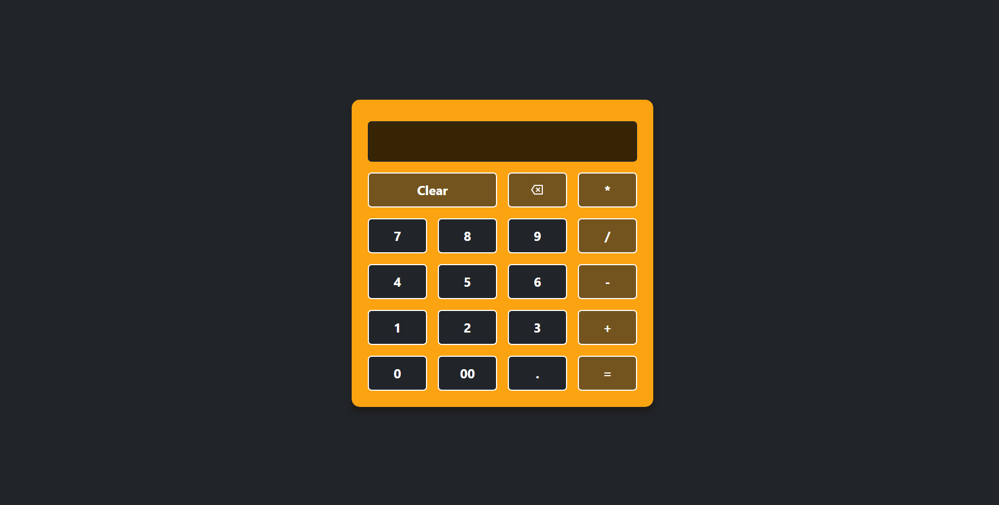

# Calculator challenge

This is a calculator challenge to put my react skills into practice.

## Table of contents

- [Overview](#overview)
  - [The challenge](#the-challenge)
  - [Screenshot](#screenshot)
  - [Links](#links)
- [My process](#my-process)
  - [Built with](#built-with)

## Overview

### The challenge

Users should be able to:

- Click the calculator buttons
- Do math operations in the calculator
- View the result in the screen and use that output to do other operations.

### Screenshot

### Links

- Live Site URL: [GitHub project page](https://manugil22.github.io/calculator/)

## My process

### Built with

- Semantic HTML5 markup
- CSS custom properties
- Flexbox
- React
